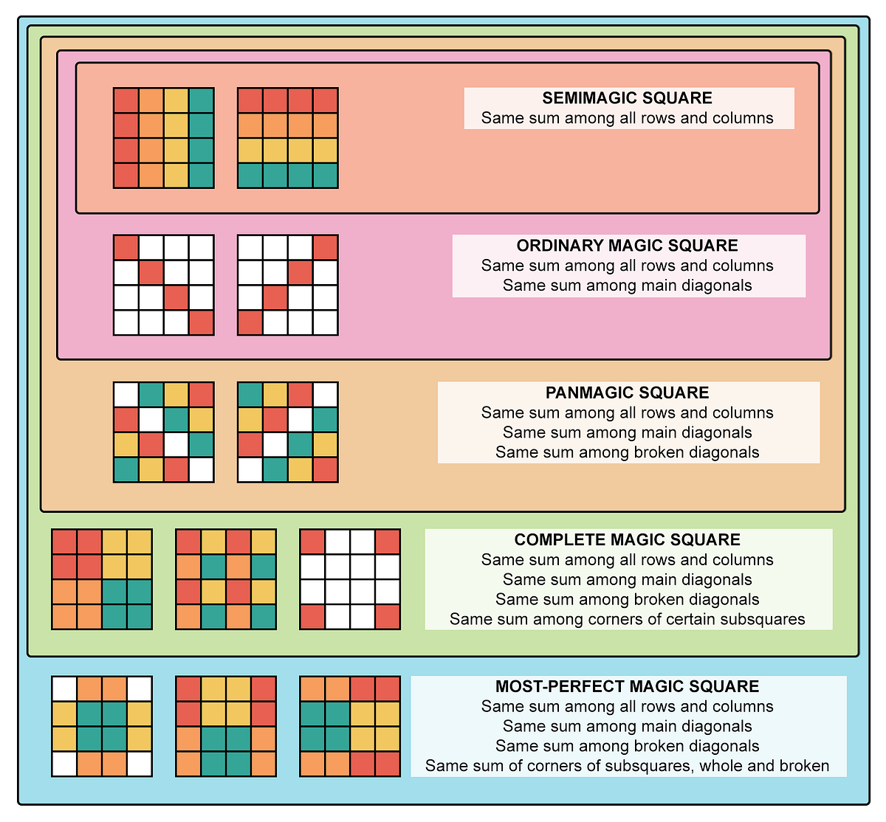

# 🎇 Magic Square Generator (Based on Date of Birth)

This project generates different types of **4×4 Magic Squares** using a
user’s **Date of Birth (DD/MM/YYYY)**.

The entire script is written using **basic Python only** (no external
libraries), making it **easy for beginners** to understand.

---

## 📘 What This Program Can Generate

### 🔹 1. Semi-Magic Square  
A square where:  
- All **rows** sum to the same number  
- All **columns** sum to the same number  
- **Diagonals are NOT required to match**

---

### 🔹 2. Ordinary Magic Square  
A magic square where:  
- Rows = Columns = Both main diagonals  
- All have the **same constant sum**

---

### 🔹 3. Pan-Magic Square  
A stronger form where:  
- Rows, columns, diagonals  
- **Broken diagonals** (wrap-around diagonals)  
All sum to the magic constant.

---

### 🔹 4. Complete Magic Square  
A square where:  
- Every **2×2 sub-square** also sums to the magic constant  
This is extremely rare and very structured.

---

### 🔹 5. Most Perfect Magic Square (MPMS)  
This is the strongest form of 4×4 magic square:  
- Semi Magic  
- Ordinary Magic  
- Pan Magic  
- Complete Magic  
- Plus perfect pair and combinational balance rules  

Only very specific patterns can satisfy MPMS.

---
## 🖼️ Visual Understanding



## 🧠 How It Works

1. User enters their **DOB**  
2. The program extracts:  
   - `a0` = DD  
   - `b0` = MM  
   - `c0`, `d0` = year digits  
3. The algorithm checks for valid non-negative, non-repeating values  
4. It constructs:  
   - Second row  
   - Third row  
   - Fourth row  
   Using equations that maintain magic sum constraints.

---

## ▶️ Running the Program

```bash
git clone https://github.com/yuva-kiran-18/BirthdayMagicSquare.git
python magic.py
Enter Date of Birth(dd/mm/yyyy)  ::   25/05/2006
The semi magic square is ...
25   5   20   6

2    24   7    23
13   17   8    18
16   10   21   9

The Ordinary Magic square is ...
25   5   20   6

7    19   12   18
8    22   3    23
16   10   21   9

The Pan Magic Square is ...
25   5   20   6

7    19   12   18
8    22   3    23
16   10   21   9

The complete Magic Square is ...
25   5   20   6

7    19   12   18
8    22   3    23
16   10   21   9

The Most Perfect Magic Square is ...
25   5   20   6

7    19   12   18
8    22   3    23
16   10   21   9

Your Birthday Satisfies All Magic Square conditions ...
The Final Most Perfect Magic Square is ::

25   5   20   6
7    19   12   18
8    22   3    23
16   10   21   9
---

## 👨‍💻 Author
**Yuva Kiran Kumar**  
Python Developer | Logic Designer  

---

## 📜 License
This project is open-source under the **MIT License**.
